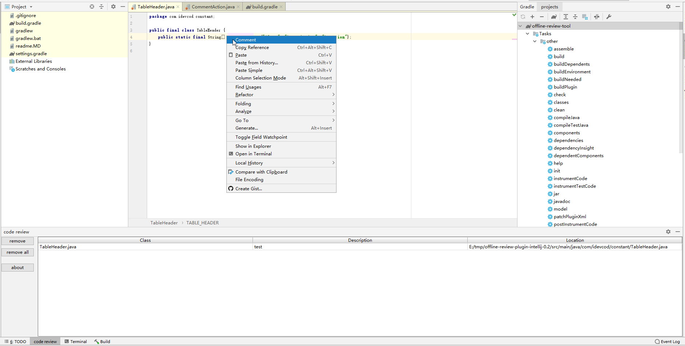

# A offline review plugin for Intellij

## Compile
We use gradle to manage project.

Before run the project, we need config the intellij sdk.
[Configuring IntelliJ Platform Plugin SDK](https://www.jetbrains.com/help/idea/configuring-intellij-platform-plugin-sdk.html)

## Screenshot

## Debug
Open the gradle page, click Tasks -> intellij -> runIde

## Build
Open the gradle page, click Tasks -> intellij -> buildPlugin.

The jar will be under the build -> libs. 

## Feature
* when double click the comment row, it will jump to the source file.

## FAQ
1. Unable to import gradle project.  
Change the gradle jvm to JAVA_HOME
[Unable to import grails 3 project in intellij idea community edition](https://stackoverflow.com/questions/49642207/unable-to-import-grails-3-project-in-intellij-idea-community-edition) 

## Todo List
1. upload the plugin to Intellij plugin market
2. support csv file import and export